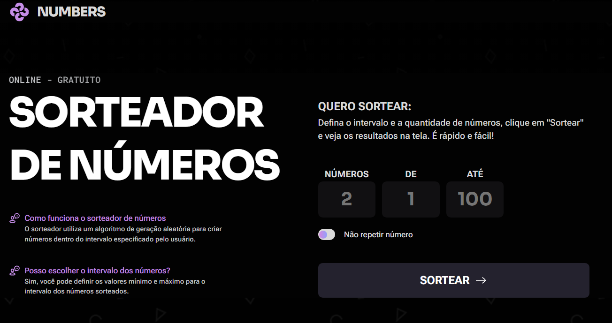

# Quicklist

Uma simulação de lista de compras da semana. O usuário pode adicionar novos itens, marcar produtos como comprados e excluir itens da lista.



## Funcionalidades

- Adicionar novos itens à lista.
- Marcar itens como comprados.
- Remover itens da lista.
- Exibir uma mensagem de confirmação ao remover um item.
- Validar o nome do item com uma expressão regular, aceitando letras e espaços.
- Responsividade: Mobile-first

## Tecnologias

- HTML5
- CSS3
- JavaScript

## Como executar

1. Clone o repositório:

```bash
git clone https://github.com/guilhermexpc/rocketseat-fs-desafio-lista-de-compra.git
```

2. Abra o arquivo `index.html` no navegador.

Também é possível usar a extensão **Live Server** no VS Code para executar o projeto em um servidor local.

Ela permite palavras formadas por letras, incluindo caracteres acentuados, separadas por espaços simples.

## Estrutura do projeto

```text
.
├── assets/
├── styles/
├── index.html
├── script.js
└── screenshot-project.png
```

## Projeto

Este projeto foi desenvolvido como desafio prático do curso de Javascript da Rocketseat.
