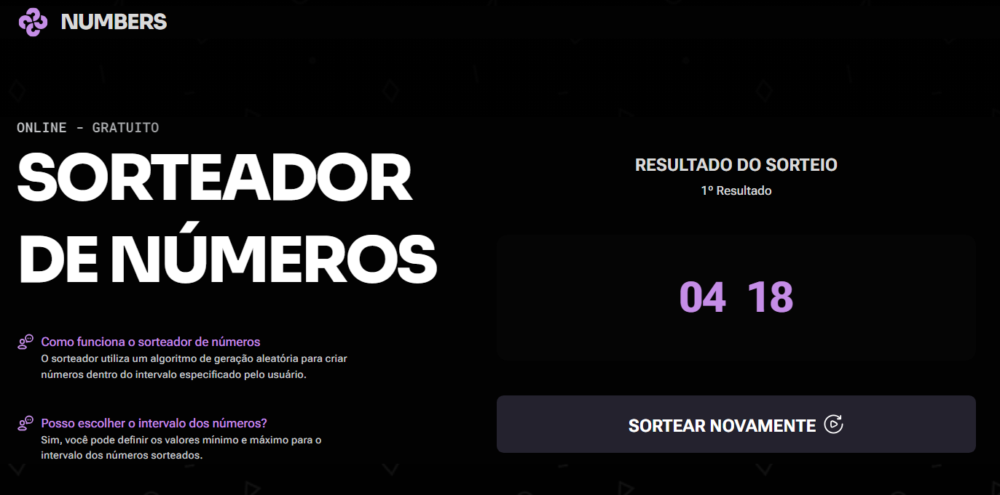

# Sorteador de números

Site responsível para sortear números com base na quantidade de números desejada e em um intervalo mínimo e máximo.

## Página inicial


## Número sorteado



## Funcionalidades

- Definir a quantidade de números para sortear.
- Definir o valor mínimo e o valor máximo do intervalo.
- Sortear números sem repetição.
- Exibir os números sorteados com dois dígitos quando necessário.
- Permitir realizar um novo sorteio.
- Validar os valores informados no formulário.
- Layout responsivo para dispositivos móveis e desktop.

## Tecnologias

  
  


## Como executar

1. Clone o repositório:

```bash
git clone https://github.com/guilhermexpc/rocketseat-fs-desafio-sorteador-de-numeros.git
```

2. Abra o arquivo `index.html` no navegador.

Também é possível usar a extensão **Live Server** no VS Code para executar o projeto em um servidor local.

## Estrutura do projeto

```text
.
├── assets/
│   ├── icons/
│   ├── linha.png
│   └── logo.svg
├── styles/
│   ├── component.css
│   ├── footer.css
│   ├── form.css
│   ├── global.css
│   ├── header.css
│   ├── index.css
│   └── result.css
├── index.html
├── script.js
└── README.md
```

## Repositório

[GitHub - Sorteador de números](https://github.com/guilhermexpc/rocketseat-fs-desafio-sorteador-de-numeros)

## Projeto

Este projeto foi desenvolvido como desafio prático do curso de JavaScript da Rocketseat.
